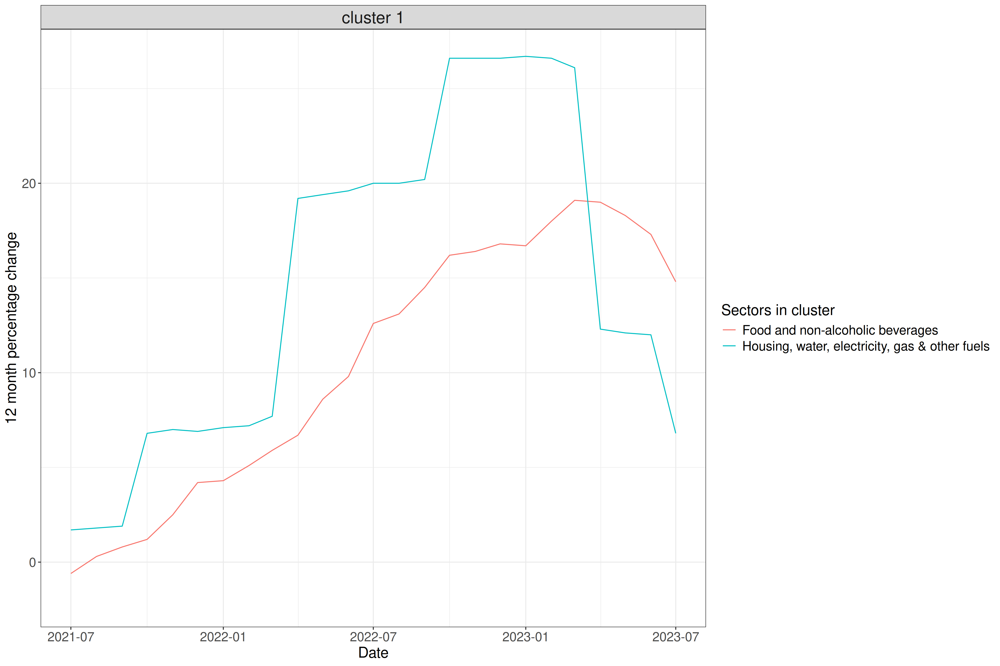
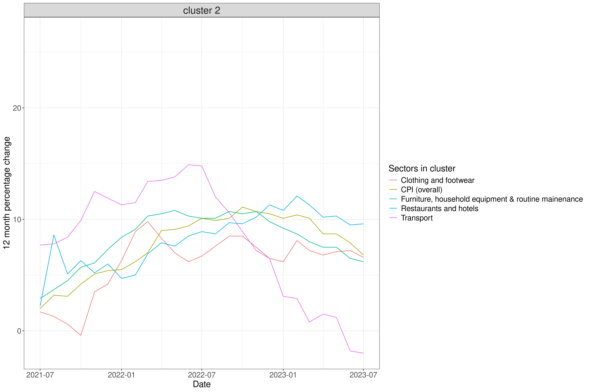
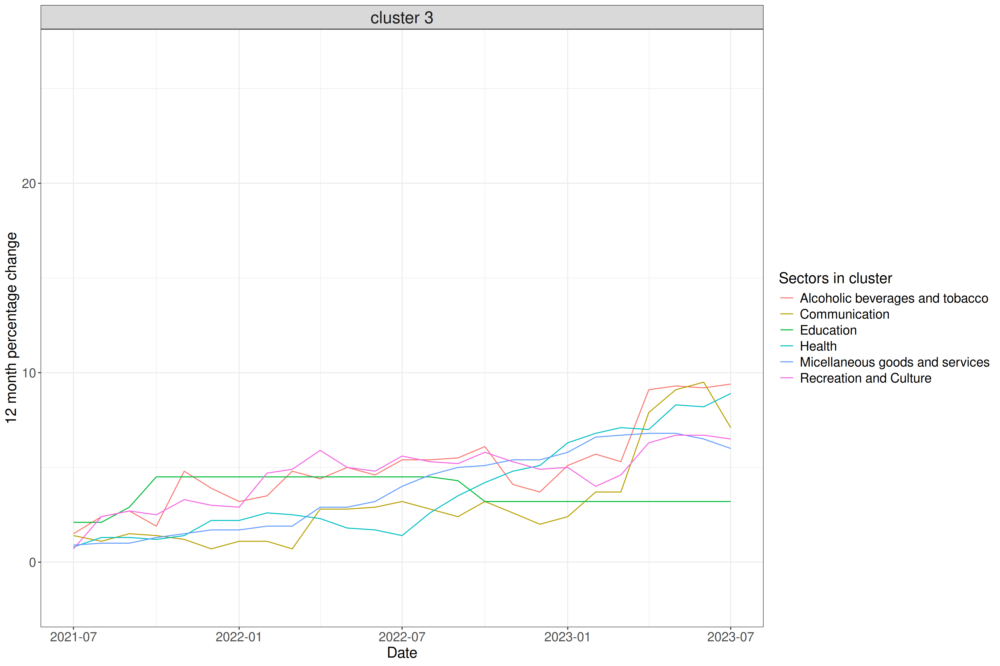

# Data Science for Policy: Energy Prices and CPI Trends in Great Britain

## Author
[Rhianna Leslie](https://github.com/rhiannaleslie)

## Overview

This project investigates the relationship between rising energy prices and inflation across different economic sectors in Great Britain. Using publicly available ONS data, clustering analysis was applied to identify which sectors and food product categories experienced CPI trends most similar to energy price inflation between 2021 and 2023.

**Research question:** Can clustering analysis identify patterns amongst UK sector CPI trends, and what sectors show similar trends to energy price inflation?

## Key Findings

- Energy prices fluctuated substantially over 2021–2023
- Food price inflation was found to closely mirror household energy costs
- Dairy, flour, and frozen vegetables experienced the largest CPI variation of all food product categories

**For a full walkthrough (including verbal explanation) of the findings, see the *project_summary.pptx*.**

## Cluster Visualisations

**Sector CPI clusters:**

<table>
  <tr>
    <td></td>
    <td></td>
    <td></td>
  </tr>
</table>


---

**Food product CPI clusters:**

<table>
  <tr>
    <td></td>
    <td></td>
    <td></td>
    <td></td>
  </tr>
</table>

---


## Data Sources

 - ONS System Average Price (SAP) of gas: System Average Price (SAP) of gas - Office for National Statistics (ons.gov.uk)
 - ONS Consumer price inflation tables - Consumer price inflation tables - Office for National Statistics 

## Methodology

K-means clustering was applied to two datasets — CPI all-sectors and CPI food products — to identify groups exhibiting similar inflation trends over time, using monthly percentage change values as features. 

The optimal number of clusters was determined via the elbow method, evaluating within-cluster sum of squares (WSS) across 1–5 clusters, yielding 3 clusters for the all-sectors data and 4 for the food products data. 

Clustering quality was assessed using the silhouette score, and results were visualised alongside silhouette plots for each dataset.

## Project Structure

├── data/
│   ├── cpi_tables.xlsx
│   └── sap_prices_gas.xlsx
├── R/
│   ├── depends.R
│   └── utils.R               # Helper functions 
├── scripts/
│   ├── clustering.R
│   ├── data_exploration.R
│   └── get_cpi_data.R        # Data ingestion & processing
├── outputs/
│   ├── sectors_cluster.png
│   ├── food_type_cluster.png
│   ├── sectors_elbow.png
│   ├── food_type_elbow.png
│   └── clustering_sil_scores.txt
├── .gitignore 
├── project_summary.pptx      # Full summary of project
├── README.md
└── run.R                     # Entry point for outputs

## Reproducing the Analysis

**Requirements:**
- R (≥ 4.0)
- Key packages can be found in `R/depends.R`

**Steps:**

```r
source("run.R")
```

All outputs will be saved to the `outputs/` directory.